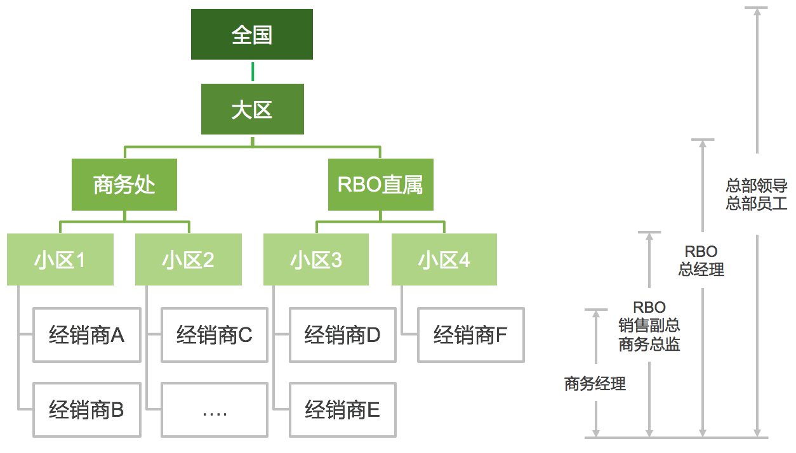
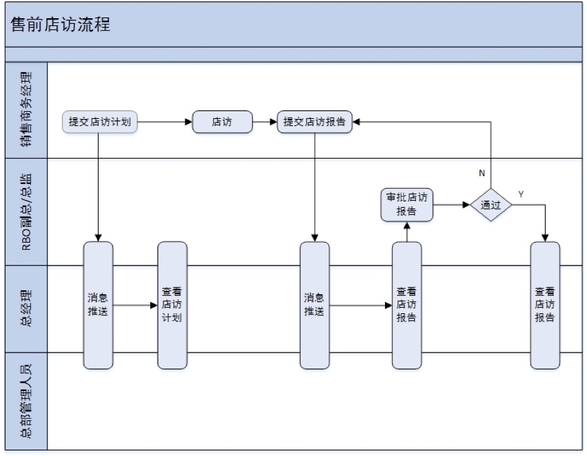
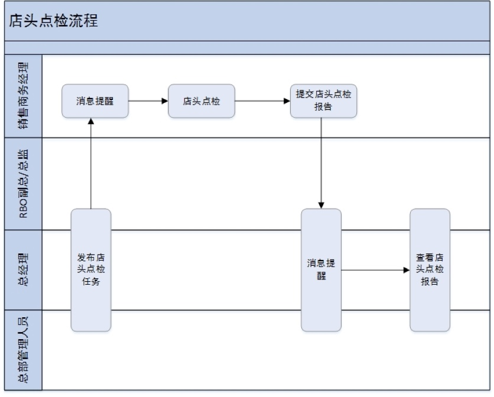
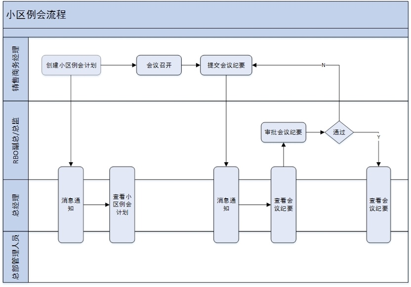

# 车厂

## 车厂中涉及到的概念

### 批零交

批零交==批售，零售，交车

* 批售：经销商进货=车厂一次性发给多少台车给某经销商，
* 零售：经销商卖车=经销商把车卖给了某个车主，车主已签合同，已付款？
* 交车：车主提车=经销商把车给了车主

## 车厂中的人员和角色

车厂中所涉及的人员/角色

### 根据区域划分

按照负责区域范围的层级

* 全国
* 大区
  * 省
* 小区

总部（总部领导／总部员工）-> 大区（RBO总经理）-> 商务处（销售副总／商务总监）-> 小区（商务经理）

* 营销大区 Skoda RBO ：大区经理
  * 比如 大西南区
* 销售小区 Sales area：小区经理
  * 比如 渝贵区
* 商务经理 Sales manager：
  * 比如 张三

角色和所能看到的报表的对应关系：

* 总部领导／总部员工：所有大区
  * 是否包含其下各级的分层的数据（商务部，小区，经销商）？
* RBO总经理，RBO副总／总监：所属大区（以及其下区域-》小区-》经销商）
* RBO商务经理：所属小区（以及其下经销商）

* 商务经理=小区负责人
* 商务总监／销售副总==RBO领导
* 总部工作人员==总部员工==总部同事
* 总部领导

-》

* RBO
  * RBO总经理==大区经理
  * RBO领导
    * 商务总监==RBO总监==首（席）代（表）
    * 销售副总==RBO副总
  * RBO商务经理==小区经理
* 总部（比如大众是上海安亭，汽车城）
  * 总部领导
  * 总部工作人员==总部员工

用下图表示：

用下表详细举例：

| 区域层级划分 | 人员角色等级 | 举例说明 |
| ---------- | ---------- | ------- |
| 全国=多个大区 | 总部领导／总部员工 | <ul><li>全国 = 总部领导、总部员工</li><ul><li><b>HZ(Dongnan)=东南大区=大东南区</b></li><li>BJ(Huabei)=华北大区=大华北区</li><li>NJ(Huadong)=华东大区=大华东区</li><li>GZ(Huanan)=华南大区=大华南区</li><li>JN(Huazhong)=华中大区=大华中区</li><li>XA(Xibei)=西北大区=大西北区</li><li>CD(Xinan)=西南大区=大西南区</li><li>CS(Zhongnan)=中南大区=大中南区</li></ul> |
| 单个大区=多个商务处 | RBO总经理=大区经理 | <ul><li>大东南区 = 大区经理</li><ul><li>RBO直属</li><li><b>上海商务处</b></li></ul>|
| 单个商务处=多个小区 | RBO销售副总／总监=商务总监？ | <ul><li>上海商务处 = 商务总监</li><ul><li><b>上海东区</b></li><li>上海西区</li></ul>|
| 单个小区=多个经销商 | RBO商务经理=小区经理 | <ul><li>上海东区／RBO商务经理</li><ul><li>上海云峰交运汽车销售服务有限公司</li><li><b>上海江湾五角场汽车销售服务有限公司</b></li><li>上海绿地徐捷汽车销售服务有限公司</li><li>上海永达巴士汽车销售服务有限公司</li><li>上海百联沪北汽车销售有限公司</li><li>上海交运起成汽车销售服务有限公司</li><li>上海安吉斯领汽车销售服务有限公司</li><li>上海东昌思达汽车销售服务有限公司</li></ul>|

> **[warning] 经销商关系是动态变化的**
>
> 需要注意的是，对于车厂下面的这么多家经销商，每家经销商以及对应的区域和公司的负责人等等的经销商关系都是动态变化的
>
> 这意味着：如果你给车厂开发类似的管理系统，则会遇到：不定期，比如一个月左右，就需要更新一次经销商关系

## 车厂会涉及的任务

主要是小区经理负责的**任务**：

典型的小区经理需要负责的任务有：

* 售前店访
  * 涉及事项：
    * 店访计划
    * 店访报告
* 店头点检
  * 点检计划
  * 最终的点检统计
* 小区例会
  * 例会计划
  * 例会报告

### 任务流程

#### 售前店访流程

#### 店头点检流程

#### 小区例会流程

