# 大众汽车集团

## 上汽大众的缩写和历史

* 首先是有个：**大众集团**
* 其次国内是有个：**上汽集团**
* 接着是中外合资而有了：**上海大众**
* 后来改名为：**上汽大众**

而关于职能方面，之前上海大众？是分两个公司的：

* 负责制造车辆的
* 负责销售车辆的

现在是合在一起了，叫做**上汽大众**

下面通过缩写对比来详细解释对应的含义：

### vw/svw/csvw/saic对比

#### vw 大众

`vw`=`VOLKSWAGEN`=`Volkswagen`=`volkswagen`=`德国大众`=`大众汽车`=`大众汽车股份有限公司`

含义解释：

* `Volks`=(德语指)人民（大众）
* `Wagen`=汽车

-> `Volkswagen`=`人民大众的汽车`

大众的LOGO是：

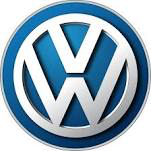

-> `大众集团`=`Volkswagen Group`，主要包括子品牌：

* Audi 奥迪
* Skoda 斯柯达
* Bentley 宾利
* Bugatti 布加迪
* Lamborghini 兰博基尼

#### SAIC 上汽集团

`SAIC`=`SAIC Motor`=`上汽汽车（集团）`=`上汽集团`

其中：Motor指**汽车**

对应主页：[上海汽车集团股份有限公司](http://www.saicmotor.com/chinese/index.shtml)

http://www.saicmotor.com/chinese/index.shtml

上汽集团的LOGO：

`上汽集团`下属的子品牌，主要是一些整车企业：

* 荣威
* MG
* 乘用车公司
* 上汽大通
* 上汽大众
* 上汽通用
* 上汽通用五菱
* 南京依维柯
* 上汽依维柯红岩
* 上海申沃

#### csvw=svw 上汽大众

对应的缩写的全称分别是：

* 之前叫：`上海大众`=`csvw`=`Shanghai Volkswagen`=`China SAIC VOLKSWAGEN`=全称是`Shanghai Volkswagen Automotive Co., Ltd`
* 后改名：`上汽大众`=`svw`=`SAIC VOLKSWAGEN`=全称是`SAIC Volkswagen Automotive Co., Ltd.`=`上汽集团`和`大众集团`的合资公司

##### csvw 上海大众

上海大众的官网： [上汽大众汽车有限公司](http://www.csvw.com)

http://www.csvw.com

上海大众的LOGO：

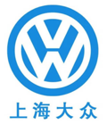

##### svw 上汽大众

上汽大众的官网：[上汽大众品牌官网 SAIC VOLKSWAGEN](http://www.svw-volkswagen.com/zh.html)

http://www.svw-volkswagen.com/zh.html

对应上汽大众的LOGO：

或：

## 上汽大众简介

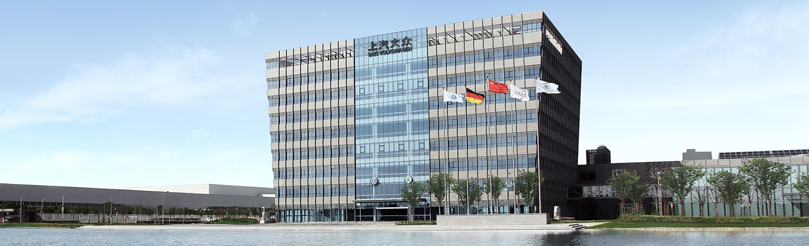

> 上汽大众汽车有限公司是一家中德合资企业，由上汽集团和大众汽车集团合资经营。
>
> 公司于1984年10月签约奠基，是国内历史最悠久的汽车合资企业之一。
>
> 公司总部位于上海安亭，并先后在南京、仪征、乌鲁木齐、宁波、长沙等地建立了生产基地。
>
>
> 上汽大众汽车有限公司由上汽集团和大众汽车集团合资经营，公司总部位于上海安亭，并先后在南京、仪征、乌鲁木齐、宁波、长沙等地建立了生产基地。
>
>作为国内历史最悠久的汽车合资企业之一，上汽大众率先在自主研发、技术创新等方面开展了大力探索和有益实践，不仅培养了一支高效率、高素质的开发队伍，也建立了功能完善、具备国际水平的技术开发中心。从桑塔纳的技术引进，到桑塔纳2000型和帕萨特轿车的联合开发，从桑塔纳3000型起对自主开发的探索，到New Passat新帕萨特、Lavida家族的成功研发，上汽大众走出了一条从引进吸收、联合开发到自主研发的创新道路。目前，企业已初步具备内外造型，前期开发，车身开发，发动机、底盘和电器集成开发和认可的自主开发能力。
>
> 多年以来，上汽大众以可靠的产品和贴心的服务赢得了广大消费者的支持与信赖。目前企业拥有大众、斯柯达两大汽车品牌，共十余个系列产品，覆盖A0级、A级、B级、C级、SUV、MPV等细分市场。其中，大众品牌车型有Polo、Santana桑塔纳、Lavida家族、Lamando凌渡、Passat帕萨特、PHIDEON辉昂、Tiguan途观、Touran途安，斯柯达品牌车型有Fabia晶锐，Rapid昕锐，RapidSpaceback昕动，Octavia明锐，Superb速派和Yeti。

## 上汽大众的车系车型名称

先上个全家福：

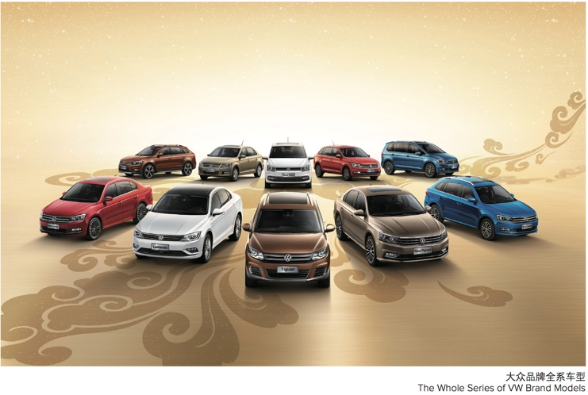

再整理如下表：

| 细分市场类型 | 车系=车型大类 | 中文名 | 子车系 |
| ---- | ----------- | ----- | ----- |
| 上汽大众子品牌 | |  |  |
| 精品小车 | Polo | 波罗 | New Polo  Cross Polo 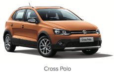 Polo GTI/A0级车  |
| | Santana | 桑塔纳 | 桑塔纳 桑塔纳B2 桑塔纳 2000 桑塔纳 3000 桑塔纳 Vista 志俊 New Santana 桑塔纳·尚纳=全新桑塔纳 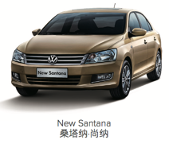 Cross Santana Gran Santana 桑塔纳 浩纳  |
| A级车 | Lavida | 朗逸 | Lavida 朗逸 New Lavida 全新朗逸  Gran Lavida 全新朗行 Cross Lavida 全新朗境  Lavida Sport 朗逸运动版 Lavida BlueMotion 朗逸蓝驱技术版 |
| 轿跑车 高端A级车 | Lamando | 凌渡 | Lamando 凌渡 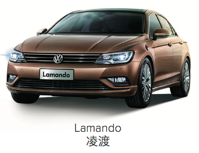 Lamando GTS 凌渡GTS  |
| B级车 | Passat | 帕萨特 | Passat帕萨特 Passat Lingyu领驭 Passat New Lingyu新领驭 New Passat全新帕萨特  |
| C级车 | Phideon | 辉昂 | |
| SUV | Tiguan | 途观 | Tiguan 途观 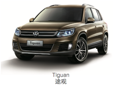 Tiguan Silk Road 途观丝绸之路版 All New Tiguan L 全新途观L |
| MPV／多功能乘用车 | Touran | 途安 | Touran 途安 All New Touran L 全新途安L 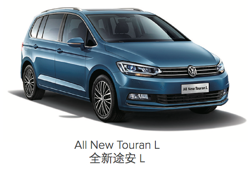|
| | Sharan | 夏朗 | |
| | | |
| 进口大众子品牌 | | |
| | | |

## 总部位置

上汽大众的总部是上海的安亭，其中包括：

* 大众宾馆：包括大众的IT部门
* 于田大厦：包括斯科达的销售部门
* 生产线：
  * 一厂
  * 二厂
  * 三厂

## 工厂地理分布和生产车系

关于工厂地理位置：

* 总部：安亭
  * 安亭一厂
  * 安亭二厂
  * 安亭三厂
* 南京工厂
* 仪征工厂
* 乌鲁木齐工厂
* 宁波工厂
* 长沙工厂

再说不同车厂的生产车系的概览：

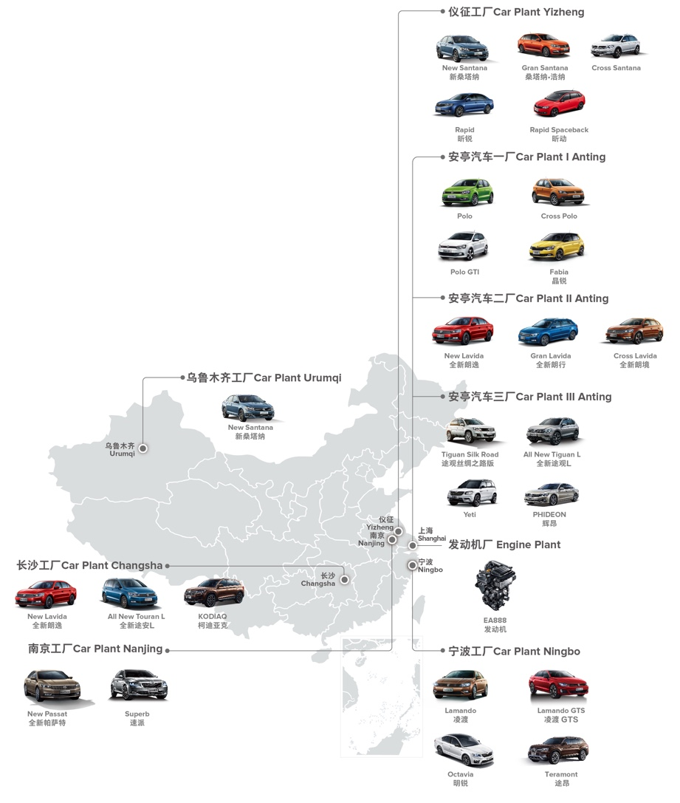

## 涉及业务

* 营业收入
  * 售后业务
    * 工时收入
      * 机修
      * 钣金喷漆
    * 维修配件收入
      * 机修
      * 钣金喷漆
    * 配件外销收入
    * 其他售后收入
  * 精品附件业务
  * 增值业务
    * 易手车业务
    * 金融业务
    * 保险业务收入
    * 延保业务收入
  * 其他业务
    * 代理服务收入
    * PDI检测收入
    * 汽车租赁收入
    * 进口大众转介绍服务收入
    * 非货币资产出租收入
    * 其他大众业务收入
    * 其他非大众业务收入

## 大众的部门

### 部门缩写

| 大众部门缩写 | 全称 |
|----------- | ---- |
| SVW SRT-1 | 客服中心运营管理 Customer Service Center   市场调研与信息 Market Research and Intelligence |
| SVW SRR | 市场研究与分析 SRR   市场调研与信息 Market Research and Intelligence |

### 部门组织架构

* 营销事业部=大众品牌营销事业部：SV
  * 销售部 SVS
  * 网发部=网络发展与管理 SVM
  * 市场部 SVA
  * 售后部 SVN

### 大众的部门/机构的分布

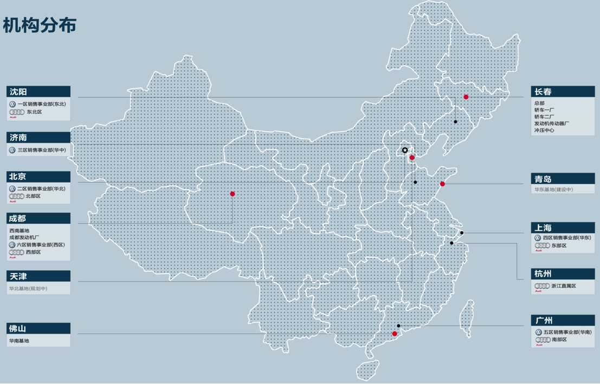
