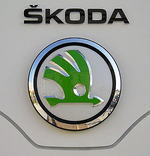
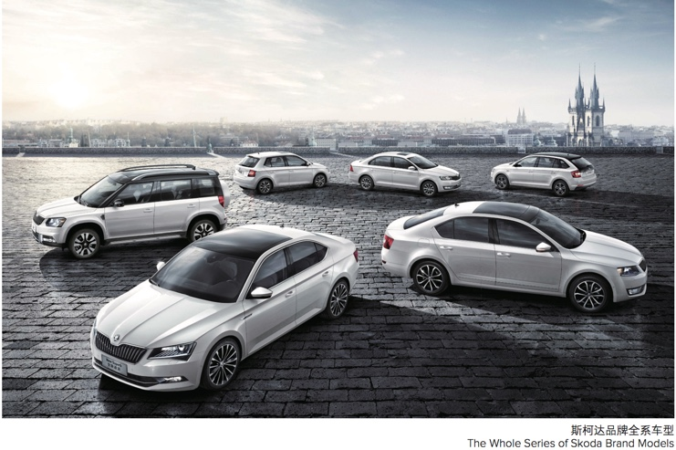
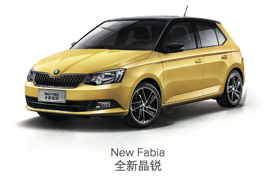
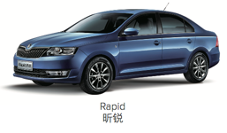
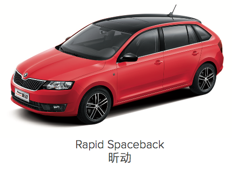
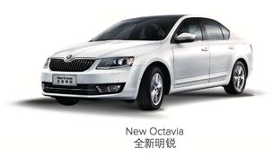
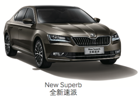
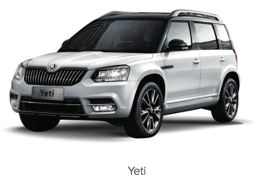

# 上汽大众 斯柯达

## 斯柯达品牌简介

斯柯达（捷克语：Škoda Auto）是一家总部位于捷克共和国的汽车制造商。创立于1895年。1991年，斯柯达成为大众集团旗下的品牌，并在2000年被大众集团收购，作为其旗下的入门级品牌。

## 斯柯达logo

## 斯柯达的车型

斯科达的全系车型：

详细的车型分类：

| 细分市场类型 | 车系=车型大类 | 中文名 | 子车系 |
| ---------- | ----------- | ----- | ----- |
| 高端 A0 级小车 | Fabia | 晶锐 | 跨界车型 Fabia Scout 运动版 Fabia Sport 赛车风格 Fabia Monte Carlo New Fabia全新晶锐=Fabia NF  |
| 中级车 | Rapid | 昕锐 | Rapid昕锐    Rapid Spaceback昕动=Rapid SP  |
| A 级车 | Octavia | 明锐 | 老明锐=Octavia A5/WL=Octavia WL 新明锐=Octavia NF=New Octavia   |
| | Superb | 速派 | Superb 速派 Superb Combi New Superb 全新速派=Superb NF   |
| SUV | Yeti | 野帝 | Yeti   |
| | Kodiaq | 柯迪亚克 |  |

## 斯柯达的部门缩写

整理出上汽大众的斯柯达中的部门缩写：

| 斯柯达部门缩写 | 部门全称 | 中文名 |
| ----------- | ------- | ----- |
| SVW | SAIC VOLKSWAGEN | 上汽大众 |
| SK | SKODA Sales & Marketing Business | 斯柯达营销事业部 |
| | |
| SKS | SKODA Sales (Dept.) | 斯柯达销售部 |
| SKSC | SKODA CRM & Retail Marketing | 斯柯达CRM与零售营销科 |
| SKSR | SKODA Regional Sales Strategy | 斯柯达区域营销策略科 |
| SKSS | Skoda Sales Planning & Steering | 斯柯达销售计划（控制科） =销售计划与控制科 |
| SKSI | SKODA Import Management | 斯柯达品牌进口车业务管理科|
| | |
| SKM | SKODA Marketing | 斯柯达品牌市场营销部 |
| SKMM | SKODA Media Planning | 斯柯达品牌媒介规划科 |
| SKMP | SKODA Product Marketing | 斯柯达品牌产品营销科|
| SKMS | SKODA Communication Strategy | 斯柯达品牌传播策略科 |
| | |
| MRS | SKODA Brand PR | 斯柯达品牌公关 |
| MRV | VW Brand PR | 大众品牌公关 |
| MR-1 | Marketing Event Support | 市场活动支持 |
| | |
| SVW SKNT-2 | Skoda Network Dept | 斯柯达网络发展与管理
| SVW CIM | | 信息系统部 |
