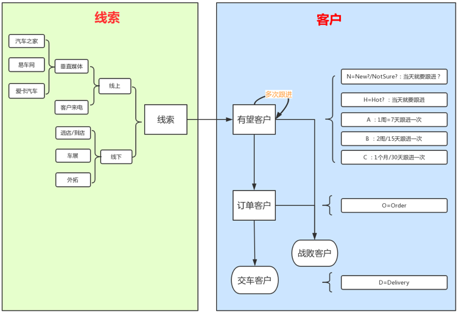

# 汽车销售全过程概览

在汽车销售领域，基本的客户状态变化可以用下图表示：

即，从线索到客户（潜客）。

而后续整理出了更详细的流程：

> **[info] 最新版本的在线分享 **
>
> 想要最新版本的整理，可以去在线分享的地址中查看：
>
> [汽车销售领域客户状态变化流程结构图 | ProcessOn免费在线作图,在线流程图,在线思维导图](https://www.processon.com/view/link/5a604c7ae4b0a447b9adda93)

对应的：
* 线索
    * 内部也有多次跟进，类似于后续的客户跟进，但是没那么复杂
* 客户整个生命周期都有多次跟进
    * 每次跟进又分
        * 本次跟进
            * 跟进时间
            * 跟进方式
            * 跟进内容
            * 是否需要更改 客户类别
                * 比如从：
                    * 有望 转 订单
                    * 订单 转 交车
                    * 有望 转 战败
                        * 一般需要上级（销售经理）审批
        * 预计下次跟进
            * 跟进时间
            * 跟进方式
            * 跟进内容
            * 备注
* 有些系统中还有另外一个客户状态：休眠客户
    * 指的是：这个客户暂时不买车，但是后续可能买车
    * 状态流转可能就会有相关的
        * 有望 转 休眠
        * 休眠 转 有望
            * 休眠的激活 也可能/或不需要 上级（销售经理）的审批

而关于销售过程中的其他信息，比如**客户类型**、**购车意向级别**等信息，后续会详细介绍。

整个汽车销售的过程，可以用一句话概括：

**（4S店的各个部门的）一堆人努力促成（你作为一个）客户尽快买车**
